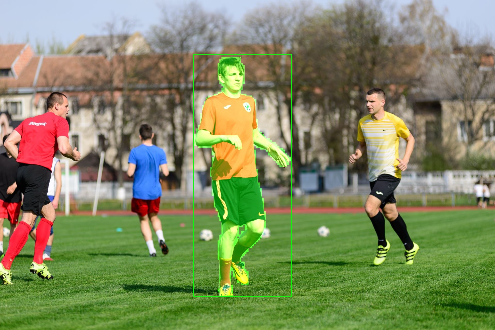

# MobileSAM

## 模型导出
- 进入 submodule 路径 `convert/MobileSAM`,运行以下命令
    ```shell
    $ python scripts/export_onnx_model.py --checkpoint ./weights/mobile_sam.pt --model-type vit_t --output ./mobile_sam_decoder.onnx

    Loading model...
    Exporting onnx model to ./mobile_sam_decoder.onnx...
    ============== Diagnostic Run torch.onnx.export version 2.0.1+cpu ==============
    verbose: False, log level: Level.ERROR
    ======================= 0 NONE 0 NOTE 0 WARNING 0 ERROR ========================

    ============== Diagnostic Run torch.onnx.export version 2.0.1+cpu ==============
    verbose: False, log level: Level.ERROR
    ======================= 0 NONE 0 NOTE 0 WARNING 0 ERROR ========================

    Model has successfully been run with ONNXRuntime.
    ```
    可以看到目录下多了两个模型文件 `mobile_sam_encoder.onnx` `mobile_sam_decoder.onnx`


- 运行以下命令，剔除不需要的输出节点
  ```shell
  python onnx_edit.py 
  ```
  目录下会多出一个 `mobile_sam_decoder_sub.onnx`

- 运行以下命令，将动态shape改为固定shape
  ```
  $ onnxsim mobile_sam_decoder_sub.onnx mobile_sam_decoder_sub_sim.onnx --input-shape point_coords:1,5,2 point_labels:1,5

    WARNING: "--input-shape" is renamed to "--overwrite-input-shape". Please use it instead.
    Your model contains "Tile" ops or/and "ConstantOfShape" ops. Folding these ops can make the simplified model much larger. If it is not expected, please specify "--no-large-tensor" (which will lose some optimization 
    chances)
    Simplifying...
    Finish! Here is the difference:
    ┏━━━━━━━━━━━━━━━━━┳━━━━━━━━━━━━━━━━┳━━━━━━━━━━━━━━━━━━┓
    ┃                 ┃ Original Model ┃ Simplified Model ┃
    ┡━━━━━━━━━━━━━━━━━╇━━━━━━━━━━━━━━━━╇━━━━━━━━━━━━━━━━━━┩
    │ Add             │ 83             │ 83               │
    │ Cast            │ 48             │ 6                │
    │ Concat          │ 42             │ 3                │
    │ Constant        │ 480            │ 172              │
    │ ConstantOfShape │ 5              │ 0                │
    │ Conv            │ 3              │ 3                │
    │ ConvTranspose   │ 2              │ 2                │
    │ Cos             │ 2              │ 1                │
    │ Div             │ 45             │ 24               │
    │ Equal           │ 11             │ 5                │
    │ Erf             │ 4              │ 4                │
    │ Expand          │ 6              │ 1                │
    │ Gather          │ 106            │ 5                │
    │ Gemm            │ 15             │ 15               │
    │ MatMul          │ 49             │ 48               │
    │ Mul             │ 44             │ 30               │
    │ Not             │ 1              │ 1                │
    │ Pow             │ 12             │ 12               │
    │ ReduceMean      │ 24             │ 24               │
    │ Relu            │ 12             │ 12               │
    │ Reshape         │ 36             │ 33               │
    │ Shape           │ 107            │ 0                │
    │ Sin             │ 2              │ 1                │
    │ Slice           │ 3              │ 1                │
    │ Softmax         │ 7              │ 7                │
    │ Split           │ 4              │ 0                │
    │ Sqrt            │ 12             │ 12               │
    │ Sub             │ 14             │ 14               │
    │ Transpose       │ 32             │ 30               │
    │ Unsqueeze       │ 103            │ 6                │
    │ Where           │ 5              │ 0                │
    │ Model Size      │ 15.8MiB        │ 19.6MiB          │
    └─────────────────┴────────────────┴──────────────────┘
  ```

  目录下会多出一个 `mobile_sam_decoder_sub_sim.onnx`

  以上命令都在 `export.sh` 脚本文件内记录。

## 转换模型（ONNX -> Axera）

使用模型转换工具 `Pulsar2` 将 ONNX 模型转换成适用于 Axera 的 NPU 运行的模型文件格式 `.axmodel`，通常情况下需要经过以下两个步骤：

- 生成适用于该模型的 PTQ 量化校准数据集
- 使用 `Pulsar2 build` 命令集进行模型转换（PTQ 量化、编译），更详细的使用说明请参考 [AXera Pulsar2 工具链指导手册](https://pulsar2-docs.readthedocs.io/zh-cn/latest/index.html)

### 下载量化数据集
```
wget https://github.com/AXERA-TECH/MobileSAM.axera/releases/download/v2.0/dataset.tar
```
将打包好的数据集解压到 `convert/config/dataset/` 目录下

### 模型转换

#### 修改配置文件
 
检查`sam_encoder_config.json` 和`sam_decoder_config.json`中的 `calibration_dataset` 字段，将该字段配置的路径改为上一步下载的量化数据集存放路径  

#### Pulsar2 build

参考命令如下：

```
# encoder
# 650
pulsar2 build --input mobile_sam_encoder.onnx --config sam_encoder_config.json --output_dir build-output --output_name mobile_sam_encoder.axmodel --target_hardware AX650 --npu_mode NPU3 --compiler.check 0
# 630C/620E
pulsar2 build --input mobile_sam_encoder.onnx --config sam_encoder_config.json --output_dir build-output --output_name mobile_sam_encoder.axmodel --target_hardware AX620E --npu_mode NPU2 --compiler.check 0

# decoder
# 650
pulsar2 build --input mobile_sam_decoder_sub_sim.onnx --config sam_decoder_config.json --output_dir build-output --output_name mobile_sam_decoder.axmodel --target_hardware AX650 --npu_mode NPU3 --compiler.check 0
# 630C/620E
pulsar2 build --input mobile_sam_decoder_sub_sim.onnx --config sam_decoder_config.json --output_dir build-output --output_name mobile_sam_decoder.axmodel --target_hardware AX620E --npu_mode NPU2 --compiler.check 0
```
将得到 `mobile_sam_encoder.axmodel` 和 `mobile_sam_decoder.axmodel` 两个板端模型文件，导入开发板中。

## 运行
在 main.py 上修改点或框的坐标来得到其他图片的结果
### PC
返回到项目根目录，编辑修改 `python_onnx/main.py`，将 encoder 和 decoder 都修改成对应的路径。
运行以下命令，得到 mask 图片
```
python python_onnx/main.py images/test.jpg 
```

### 板端
返回到项目根目录，编辑修改 `python_ax/main.py`，将 encoder 和 decoder 都修改成对应的路径。
运行以下命令，得到 mask 图片

```
python python_ax/main.py images/test.jpg 
```

上下分别为point prompt和bbox prompt的结果


### Latency

#### AX650N

| model |latency(ms)| CMM(MiB) |
|---|---|---|
|mobilesam encoder tinyvit 1024*1024|49.495|48.334|
|mobilesam decoder|9.930|16.703|

#### AX630C

| model |latency(ms)| CMM(MiB) |
|---|---|---|
|mobilesam encoder tinyvit 1024*1024|520.044|	63.231|
|mobilesam decoder|36.382|14.970|

## 技术讨论

- Github issues
- QQ 群: 139953715
